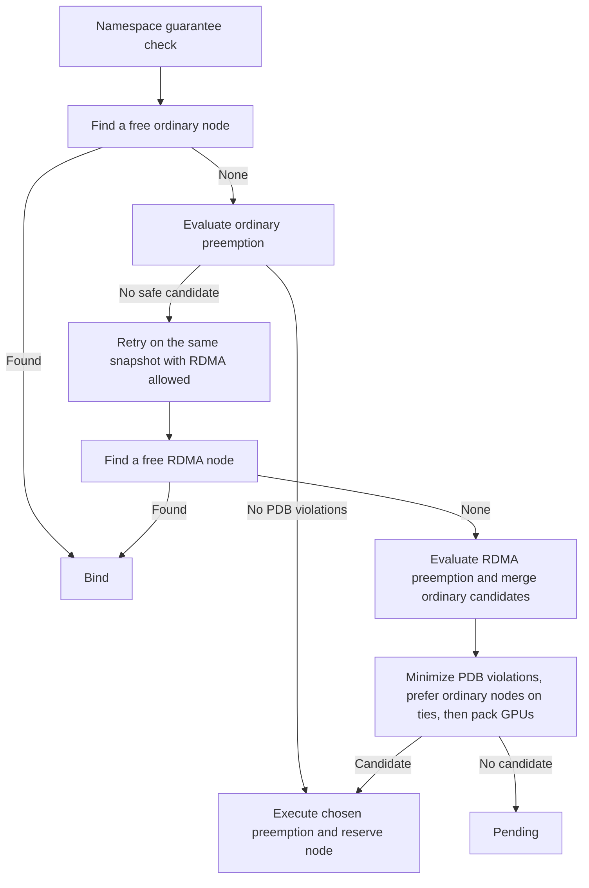

# Better-Scheduler Architecture

This document describes the design and scheduling semantics of the better-scheduler as of release `v1.32.4-bs-v0.7` (commit `22dfb9910d3`). For configuration see [configuration.md](configuration.md); for the story of how the design evolved, see [history.md](history.md).

## 1. Problem Statement

The target environment is a shared GPU pool (on the order of hundreds of GPUs) used by multiple teams, where each team maps to one or more Kubernetes namespaces. Requirements:

- Each team needs a guaranteed lane for urgent GPU workloads.
- Urgent workloads must be able to preempt opportunistic workloads when the cluster is full.
- Teams must not be able to freely self-assign urgent priority.
- Opportunistic (best-effort) usage of idle capacity must remain possible.
- Scheduler logic must stay simple and production-stable.

Design philosophy (deliberate, decided at project start):

- Correctness over optimal packing.
- Simplicity over theoretical fairness (no DRF, no queue arbitration).
- Explicit guarantees over elastic behavior.
- Scheduler stability over feature breadth.

## 2. The Two-Tier Model

- **Guaranteed tier** (historically called "protected" — see terminology note below): urgent workloads only. Identified by a single PriorityClass whose name is configured as `protectedPriorityClassName`. Hard-capped per namespace by configured resource guarantees. Can preempt normal pods.
- **Normal tier**: everything else. Opportunistic and preemptible.

A third "borrowed" tier was considered and intentionally rejected: there was no separate latency SLA and no queue semantics that would require an intermediate tier, so it would have added complexity without operational benefit.

Guaranteed pods do not preempt each other: they share one PriorityClass level, and preemption only targets strictly lower-priority pods.

**SLA wording (important for user-facing communication).** "Guaranteed" does *not* mean immune to node failure, immune to eviction for unrelated reasons (node pressure, maintenance), or immune to admin deletion. It means: protected from competition by normal/opportunistic workloads, via priority plus guarantee enforcement.

**Terminology note.** The tier was originally called "protected" and the code/config API still uses that word (`protectedPriorityClassName`, "protected pods" in comments and log messages). Operationally the concept was renamed to "guaranteed" (PriorityClass named `guaranteed`, "guaranteed tier"/"guaranteed quota" in user-facing docs and downstream application code). In this documentation "guaranteed pod" and "protected pod" are the same thing.

## 3. Why a Scheduler Plugin, Not ResourceQuota

`ResourceQuota` is admission-time: pod creation is rejected when over limit. The desired semantics are scheduling-time:

- allow pod creation regardless of current usage,
- keep over-guarantee pods **Pending** rather than rejecting them,
- schedule them automatically when namespace usage drops,
- preserve the native preemption flow once the guarantee check passes.

That behavior can only live in the scheduler.

## 4. Components

| Component | Path | Role |
|---|---|---|
| `NamespaceResourceGuarantee` plugin | `pkg/scheduler/framework/plugins/namespaceresourceguarantee/` | Guarantee enforcement, namespace-aware preemption, GPU packing, config metrics |
| `NominatedNodeReservation` plugin | `pkg/scheduler/framework/plugins/nominatednodereservation/` | Reserves nominated nodes after preemption so freed capacity is not stolen |
| Decision/rejection logging | `pkg/scheduler/schedule_one.go` | Per-pod scheduling explainability logs, gated to the `better-scheduler` profile |
| Config API | `pkg/scheduler/apis/config/types_pluginargs.go`, `staging/src/k8s.io/kube-scheduler/config/v1/types_pluginargs.go` | `NamespaceResourceGuaranteeArgs` internal + v1 types |
| Args validation | `pkg/scheduler/apis/config/validation/validation_pluginargs.go` (`ValidateNamespaceResourceGuaranteeArgs`) | Config validation at startup |
| Registration | `pkg/scheduler/framework/plugins/registry.go`, `pkg/scheduler/framework/plugins/names/names.go` | In-tree registration (not in any default plugin set — must be enabled explicitly) |

Both plugins are compiled into the standard `kube-scheduler` binary built from this fork. There is no sidecar or extender.

## 5. NamespaceResourceGuarantee Plugin

The plugin implements six extension points (see the `var _ framework.X` assertions at `namespaceresourceguarantee.go:82-87`): PreFilter, EnqueueExtensions, PostFilter, PreEnqueue, Score, and `preemption.Interface`.

### 5.1 PreFilter — guarantee enforcement

`PreFilter` (`namespaceresourceguarantee.go:168`) is the core policy:

1. If the pod is not guaranteed (`spec.priorityClassName != protectedPriorityClassName`) or no resources are configured, do nothing — the pod follows default scheduling behavior.
2. Compute the pod's requests for each configured resource (cpu, memory, extended scalar resources such as `nvidia.com/gpu`). Pods requesting zero of every configured resource are ignored.
3. Compute current guaranteed usage in the pod's namespace from the scheduler snapshot (`namespaceProtectedUsage`): only guaranteed pods, only the same namespace, only pods already assigned to a node (`spec.nodeName != ""`).
4. Enforce each resource listed for the pod's configured namespace independently: `currentUsage + requested <= namespaceGuarantee`. An omitted resource is uncapped for a configured namespace. A namespace absent from the config has guarantee `0` for resources configured anywhere.

On failure the pod gets `UnschedulableAndUnresolvable` with a message of the form:

```
namespace "team-a" protected resource guarantee exceeded: resource="nvidia.com/gpu" guarantee=32 current=31 requested=2
```

`UnschedulableAndUnresolvable` means no preemption attempt happens for that cycle — being over guarantee is not something preemption can fix. The pod stays Pending until namespace usage drops.

Accounting units (`quantityValue`, `namespaceresourceguarantee.go:1113`): cpu is counted in millicores (`MilliValue`), everything else in whole units (`Value`). This is why cpu guarantees like `500m` work correctly.

### 5.2 EnqueueExtensions — requeueing Pending pods

`EventsToRegister` (`namespaceresourceguarantee.go:214`) registers Pod `Delete | UpdatePodScaleDown` events with the `isSchedulableAfterPodChange` queueing hint: a Pending guaranteed pod is re-queued when guaranteed usage in its namespace can have decreased (a guaranteed pod in the namespace was deleted or scaled down, or the pending pod itself scaled its request down). Irrelevant changes skip the queue. This keeps Pending pods reactive without custom watchers.

### 5.3 PostFilter + preemption.Interface — namespace-aware preemption

`DefaultPreemption` is disabled in the profile and replaced by this plugin's PostFilter (`namespaceresourceguarantee.go:223`), which drives the shared `preemption.Evaluator` with plugin-specific policy:

- Preemption is only attempted for guaranteed pods; for anyone else PostFilter returns Unschedulable with `"namespace resource guarantee preemption is only enabled for protected pods"`.
- `PodEligibleToPreemptOthers` (`:371`) mirrors the default logic (respects `preemptionPolicy: Never`; waits while lower-priority victims on the nominated node are still terminating).
- `SelectVictimsOnNode` (`:398`) mirrors the default victim-selection algorithm (remove all lower-priority pods, check fit, reprieve as many as possible, PDB-violating victims last) with one key difference: the victim *ordering*.

Victim ordering (`utilMoreImportantByNamespacePolicy`, `:634`):

1. Higher pod priority is reprieved first (standard).
2. On equal priority, namespaces are compared by their cluster-wide *preemptible usage* of the resources the node is deficient in (`compareNamespaceForEviction`, `:662`): pods from namespaces using **more** preemptible capacity of the deficient resource are evicted first. Preemptible usage is computed once per preemption attempt (`namespacePreemptibleUsage`, `:742`): requests of all scheduled pods with priority below the preemptor, in namespaces that appear in `namespaceGuarantees`.
3. On a further tie, pods in the preemptor's own namespace are evicted before pods from other namespaces.
4. Final tie-break: earlier start time is reprieved first (standard).

Deficient resources are ranked by normalized severity `deficit/request` (`orderedDeficientResources`, `:692`), so the comparison focuses on what the incoming pod actually lacks on that node.

The intent: when a guaranteed pod needs room, the cost is charged first to the namespaces that are borrowing the most opportunistic capacity, rather than to whoever happens to have the newest pods.

Candidate search uses the same dry-run sizing defaults as DefaultPreemption (`minCandidateNodesPercentage` 10, `minCandidateNodesAbsolute` 100 — `calculateNumCandidates`, `:623`).

### 5.4 Preemption observability — decision trace and events

Every PostFilter run builds a `preemptionDecisionTrace` (per-node victim lists, deficits, statuses) and emits:

- A klog V(2) line per evaluated candidate node with the selection reason.
- One classified event on the preemptor (`classifyPreemptionEvent`, `:840`), action `NamespaceResourceGuaranteePostFilter`, reason one of:

| Reason | Type | Meaning |
|---|---|---|
| `NamespaceResourceGuaranteePreemptionStarted` | Normal | Victims selected, node nominated; note carries `decisionID`, `nominatedNode`, bounded `victims=[...]` list |
| `NamespaceResourceGuaranteePreemptionWaiting` | Normal | Waiting for previously preempted pods to terminate |
| `NamespaceResourceGuaranteePreemptionNotHelpful` | Normal | Preemption cannot make the pod schedulable |
| `NamespaceResourceGuaranteePreemptionNoCandidate` | Normal | No candidate node found |
| `NamespaceResourceGuaranteePreemptionError` | Warning | Evaluator error |

- One event per victim (`Preempted by <ns>/<name> on node <node> (decisionID=<uid>)`, reason `NamespaceResourceGuaranteePreempted`), wired by wrapping `evaluator.PreemptPod` in `New()` (`:143`).

`decisionID` is the preemptor/workload pod UID, so preemption events and decision logs of one scheduling decision correlate. Decision logs also carry `attempt=<QueuedPodInfo.Attempts>` so one retry can be isolated from earlier attempts in LogQL.

Event notes are bounded to the Kubernetes 1024-character event-message limit: the victim list is summarized as `pod-1,pod-2,...(+N more)` (`summarizeVictimKeysForEvent`, `:921`) and all notes pass a final truncation guard (`truncatePreemptionEventNote`, `:960`). This bound exists because unbounded victim lists caused the API server to reject events in production (see [history.md](history.md)).

### 5.5 PreEnqueue

When the `SchedulerAsyncPreemption` feature gate is on, `PreEnqueue` (`:346`) keeps a pod out of the active queue while its own asynchronous preemption is still running.

### 5.6 Score — GPU packing

`Score` (`:252`) packs guaranteed GPU pods tightly:

```
score = min(protectedGPUUsageOnNode + incomingGPURequest, allocatableGPU) * 100 / allocatableGPU
```

- Applies only to guaranteed pods requesting `nvidia.com/gpu` (`scoredProtectedGPURequest`); everyone else scores a neutral 0.
- Only *guaranteed* pods' GPU requests on the node count as existing usage (`nodeProtectedResourceUsage`, `:1050`) — normal GPU usage must not attract guaranteed pods, because normal pods can be preempted away anyway.
- Enabled with a high weight (e.g. 100) so it dominates the default spreading scores.

Rationale: guaranteed pods cannot be evicted, so fragmentation caused by spreading is permanent — e.g. eight 1-GPU guaranteed pods spread across eight 8-GPU nodes make a future 8-GPU guaranteed pod unschedulable even though 56 GPUs are free. Packing is *preventive*: it avoids creating new fragmentation but cannot repair existing fragmentation.

### 5.6.1 Optional RDMA fallback

`preferNonRDMANodesForGuaranteedGPU` adds a Filter/PostFilter placement policy for
explicit guaranteed GPU Pods without an RDMA request. This is an ordered search:



Quota rejection stops before this flow. A valid in-flight nomination is allowed to
finish without a second preemption wave; a free ordinary node can still be used.
`PreemptNever` skips eviction steps. See the full contract in
[configuration.md](configuration.md#31-rdma-fallback-for-guaranteed-gpu-pods).

`NamespaceResourceGuarantee` stores the phase and evaluated ordinary candidates in
CycleState. PostFilter can return `RetryScheduling` without a nomination, and the
scheduler permits at most one immediate retry. Both passes share a snapshot; only
the final outcome reaches assume/bind or the scheduling failure handler. RDMA
nominations cannot bypass the ordinary-node search through the nominated-node
fast path. Filtering is exhaustive for affected Pods, including before extenders.

The preemption evaluator exposes separate `EvaluateCandidates` and
`ExecuteCandidate` operations. Evaluation uses cloned node and cycle state,
examines all nodes in the supplied group, and applies extenders. Reservation
cleanup is suppressed in speculative filters. The existing `Preempt` entry point
retains its behavior for other Pods and DefaultPreemption.

### 5.7 Metrics

`metrics.go` exports ALPHA config gauges and bounded policy counters. The gauges let dashboards see the effective config without reading the ConfigMap:

- `scheduler_namespace_resource_guarantee_quota{profile, namespace, resource, unit}` — configured guarantee per namespace/resource (`unit` is `millicore` for cpu, `byte` for memory, `unit` otherwise).
- `scheduler_namespace_resource_guarantee_protected_priority_class_info{profile, priority_class}` — constant 1, identifies the configured PriorityClass.

The policy counters expose aggregate PreFilter decisions, quota-exceeded resources, preemption outcomes, and successful victim deletion requests. They use only profile, namespace, tier, resource, and bounded outcome labels; Pod and node identities remain in logs.

## 6. NominatedNodeReservation Plugin

### 6.1 The race it closes

When preemption succeeds, the preemptor only gets `status.nominatedNodeName`; nothing *reserves* the freed capacity. Until the victims finish terminating and the preemptor binds, any other pod (from any profile) can be scheduled onto that node and steal the space — forcing the guaranteed pod to preempt again, potentially looping. Upstream considers nominated nodes only as a soft signal.

### 6.2 Mechanism

- After a successful PostFilter, `NamespaceResourceGuarantee.syncNominatedNodeReservation` (`namespaceresourceguarantee.go:285`) records a reservation in a process-wide shared store; on terminal failure it releases the pod's reservation.
- `NominatedNodeReservation.Filter` (`nominatednodereservation/plugin.go:70`) rejects every pod except the holder on a reserved node with `Unschedulable`: `node reserved for namespace resource guarantee preemption by <ns>/<name>`.
- `PostBind` (`plugin.go:105`) releases the reservation when the holder binds (to any node).
- Stale reservations are cleaned up inline during Filter (`isStaleReservation`, `plugin.go:149`): holder pod deleted, holder UID changed, holder terminating, holder already bound, or holder's `nominatedNodeName` moved elsewhere.
- Store semantics (`store.go`): one reservation per node and per holder pod; re-nominating a holder to a new node moves its reservation; a new holder for a node replaces the old reservation. Events `NamespaceResourceGuaranteeNodeReserved` / `...ReservationReleased` / `...ReservationCleanedUp` are emitted on the holder pod.
- Metrics expose the process-local active reservation count, bounded lifecycle transitions, and scheduling attempts blocked by the Filter, split by profile.

### 6.3 Critical deployment caveat

The store (`store.go` `SharedStore()`) is **in-memory and per scheduler process**:

- The Filter must be enabled in **every profile** of the scheduler process, otherwise pods scheduled by the other profile will not see reservations and the race remains.
- A separately running stock `kube-scheduler` (a different process) cannot see the store and would still steal reserved nodes. All workloads must be scheduled by this one binary (multi-profile), with the stock scheduler not running against the same nodes.
- Reservations do not survive a scheduler restart or leader failover; they are best-effort within a scheduler process lifetime.

## 7. Decision and Rejection Logging (`schedule_one.go`)

The scheduler emits per-pod decision explainability logs at plain `Info` level, gated by `schedulingDecisionLogsEnabled()` — i.e. only for the profile named by `detailedScoreLoggingProfile = "better-scheduler"` (`schedule_one.go:65`). Upstream only exposes this information at V(10), which is process-wide and unusably noisy; profile-gating gives always-on explainability for exactly the workloads that need it. See [observability.md](observability.md) for the full log reference and dashboard.

Six log lines, all carrying `profile`, `decisionID`, `attempt`, and `pod`:

- `Plugin scored node for pod` / `Extender scored node for pod` / `Calculated node's final score for pod` — per node (and per plugin/extender) scores.
- `Rejected node for pod` — one line per rejected node with `phase` (PreFilter/Filter/Extender), `plugin`, `reason`, `status`, `synthetic`.
- `Scheduling rejection reason summary for pod` — rejection reasons aggregated with node counts.
- `Scheduling decision summary for pod` — one line per scheduling attempt with candidate/feasible/scored counters.

Honest accounting distinction: because the scheduler stops filtering once it has found enough feasible nodes (`percentageOfNodesToScore`), nodes fall into prefilter-pruned, explicitly rejected (Filter/Extender), and simply *unevaluated* — the counters report these separately rather than calling everything "infeasible". PreFilter prunes are logged with `synthetic=true` because per-node statuses are synthesized from the aggregate PreFilter result rather than an individual node evaluation.

## 8. Separation of Concerns: Admission Webhook

The scheduler deliberately does *not* police who may use the guaranteed PriorityClass. That is the job of an admission webhook (maintained outside this repo), responsible for:

- mapping trusted intent (e.g. a label set by tooling) to the guaranteed PriorityClass,
- blocking manual self-assignment of the guaranteed PriorityClass,
- MIG policy (e.g. forbidding guaranteed MIG workloads). The plugin counts only the exact configured resource names, so MIG-only requests (`nvidia.com/mig-*`) do not count toward a `nvidia.com/gpu` guarantee.

The scheduler's only job is enforcing per-namespace guarantees at scheduling time.

## 9. Explicit Non-Goals (v1 boundaries)

- No borrowed/intermediate tier.
- No custom fairness model (DRF, weighted sharing) or queue-wide arbitration across namespaces.
- No gang scheduling.
- No dynamic policy: guarantees are static scheduler args (no CRD, no informer-driven reload). Changing them requires a config change and scheduler rollout.
- Guarantee means guaranteed *share*, not guaranteed *instant placement*: large pods can still wait due to fragmentation (mitigated but not eliminated by GPU packing).
