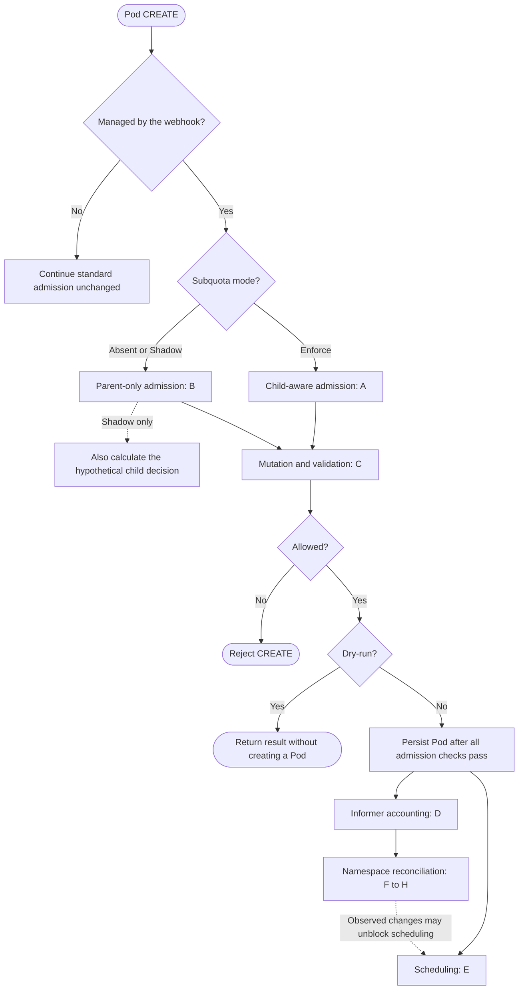
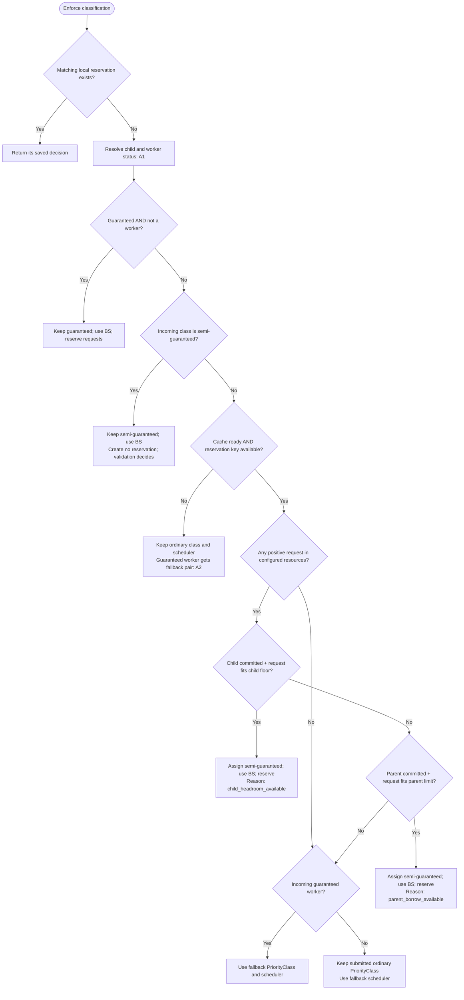
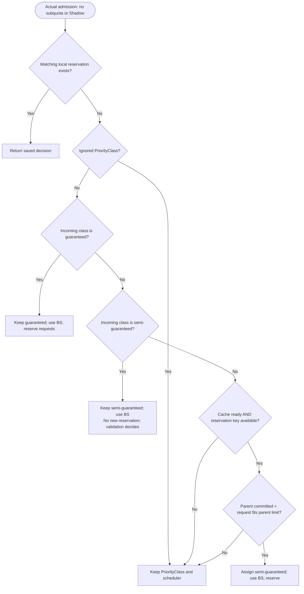
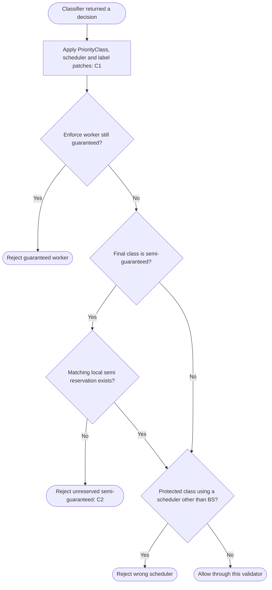
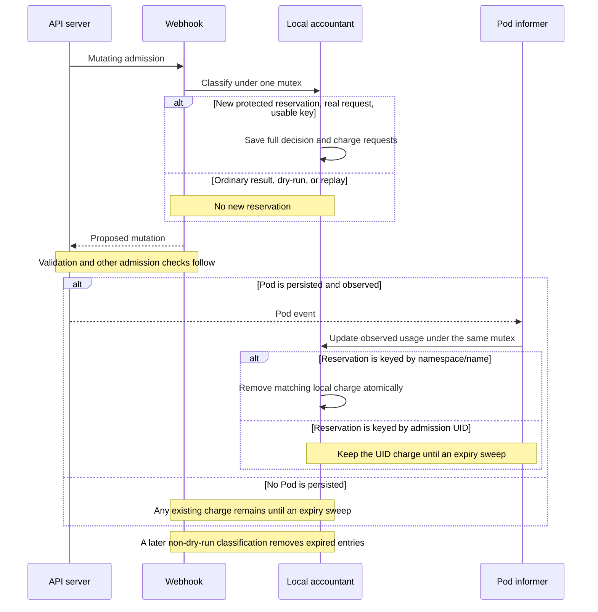
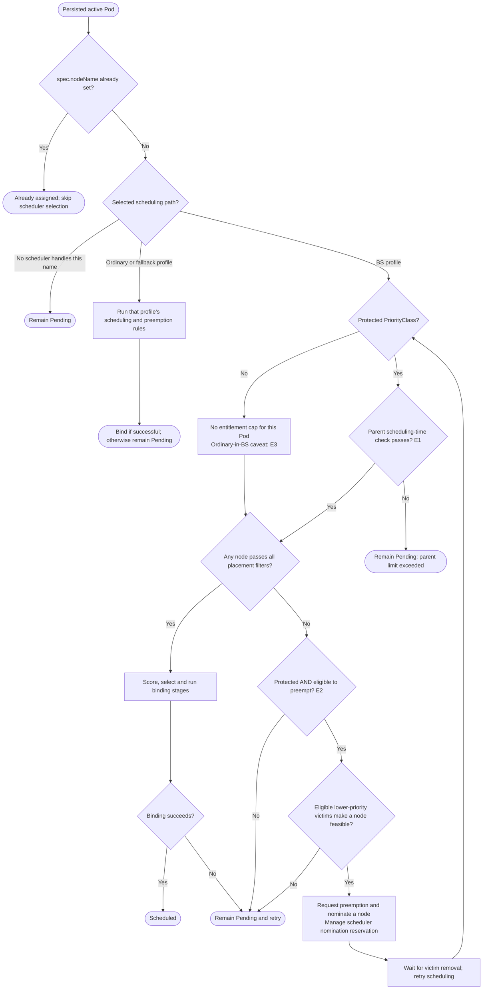
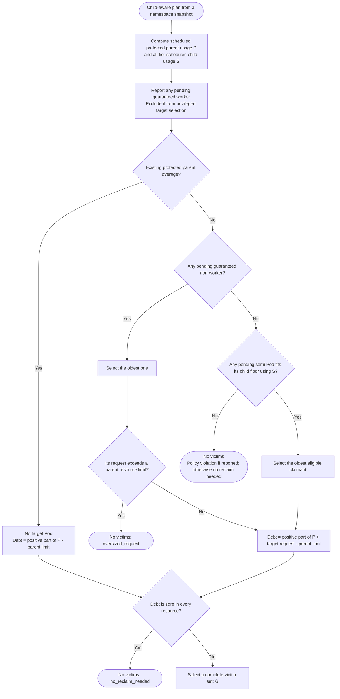
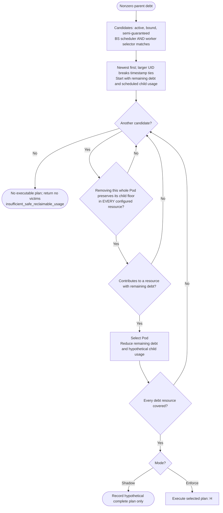
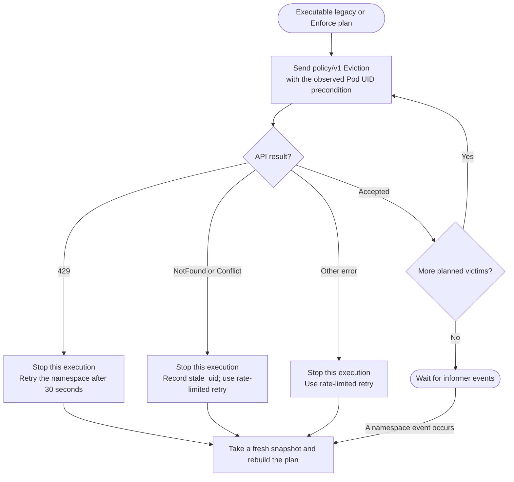

# Namespace Subquotas: Pod Decision Flow

Source audit: 2026-09-07. This document describes the checked-out webhook,
reclaimer and Better Scheduler implementation, including the dry-run defect in C.
Both component test suites and the focused NamespaceResourceGuarantee scheduler
regression passed. All nine Mermaid diagrams passed syntax validation.

Start with the overview, then expand A-H for the detailed branches and notes.

`guaranteed` and `semi-guaranteed` below are **PriorityClasses**, not Kubernetes
QoS classes. `BS` means the configured Better Scheduler profile. `Fallback`
means the configured `guaranteedWorkerFallback` fields.



Scheduling and reconciliation observe cluster state independently. Admission
chooses a tier; successful admission does not guarantee immediate placement.

<details id="enforce">
<summary>A. Enforce: child floor, parent borrowing, guaranteed workers and fallback</summary>

Each terminal block returns a decision to mutation and validation in C.
Resource accounting and the meaning of "fits" are defined in D.



A1 — Child and worker resolution:

- A known `labelKey` value selects that child. A missing or unknown value selects `defaultSubQuota`.
- Enforce patches missing or unknown values to the default child. This can also happen when PriorityClass and scheduler remain unchanged.
- A worker is any Pod matching `reclaimablePodSelector`. The classifier checks the incoming labels before applying patches.
- Driver and Redis names have no special meaning in code. Their exception comes from being **guaranteed non-workers**.

A2 — Early exits:

| Condition | Ordinary input | Incoming guaranteed worker |
|---|---|---|
| Cache not ready | Keep class and scheduler | Use both fallback fields |
| Neither Pod name nor admission UID available | Keep class and scheduler | Use both fallback fields |
| Zero requests across configured resources | Keep class; use fallback scheduler | Use both fallback fields |
| Neither child nor parent fits | Keep class; use fallback scheduler | Use both fallback fields |

The guaranteed non-worker exception runs **before** these checks. Such a Pod
keeps `guaranteed` without admission fit checks, but remains subject to the
scheduler's parent limit.

A3 — Child fit wins even when parent admission headroom is exhausted. The Pod
receives `semi-guaranteed`; its later scheduling depends on the scheduler's own
snapshot. It may need external reclaim.

A4 — `ignoredPriorityClassNames` does not bypass Enforce classification.
Ordinary non-workers also follow the child/parent fit checks; becoming
`semi-guaranteed` does not make them reclaimable workers.

A5 — `reserve` means "create a local protected reservation when this is a real
request with a usable key." Dry-run creates none. Only decisions with an
existing reservation are replayed; ordinary decisions have no reservation and
can be recalculated.

The fallback scheduler is configurable. It can be `default-better-scheduler`
when that is the deployment's ordinary profile; it must differ from `BS`.

Source: [child classifier](/workspaces/namespace-entitlement-webhook/internal/accounting/accounting.go:278).

</details>

<details id="legacy-shadow">
<summary>B. No subquota or Shadow: existing Dynamic Namespace Entitlement</summary>

This is the actual admission path when `subQuotas` is absent or its mode is
`Shadow`.



B1 — This legacy path preserves incoming `guaranteed` **including workers**.
It does not apply the Enforce worker downgrade or fallback routing.

B2 — In Shadow, the webhook also evaluates the child classifier from A using a
separate hypothetical reservation ledger. The result does not control the
Pod's mutation or validation, and child labels are not normalized.

The two ledgers share the same mutex and observed Pod state. Hypothetical
reservations do not consume actual admission headroom. Shadow is therefore an
alternative admission calculation over observed cluster state, not a fully
separate simulated cluster.

B3 — Root enforcement remains active in Shadow. The webhook can still promote
Pods, and the legacy reclaimer can still evict Pods. Shadow disables only the
new child policy's effects.

B4 — The legacy classifier has no special zero-request exit: it evaluates the
parent fit check.

Source: [legacy classifier and mode selection](/workspaces/namespace-entitlement-webhook/internal/accounting/accounting.go:217).

</details>

<details id="validation">
<summary>C. Mutation, validation, dry-run and startup behavior</summary>

This diagram applies to managed Pod CREATE requests after the classifier returns.



C1 — Mutation details:

- Change PriorityClass and scheduler when required by the decision.
- When PriorityClass changes, remove an existing numeric `spec.priority`.
- In Enforce, normalize missing or unknown child labels. JSON pointer paths escape `/` and `~`.
- Reapplying the same patch preserves the same field values.
- Validation checks the resulting Pod, including its resulting worker labels.

C2 — Manual semi-guaranteed protection and the dry-run defect:

An incoming `semi-guaranteed` class does not create a reservation by itself.
Validation requires a matching reservation already held by the webhook.

**Current implementation defect:** a fresh dry-run can be promoted to
`semi-guaranteed` by mutation and then rejected by validation, because dry-run
creates no reservation. This was reproduced for legacy, Shadow and Enforce.
Successful preview admission must not be assumed for that branch.

C3 — Other admission outcomes:

| Situation | Current behavior |
|---|---|
| Other operation or resource | These handlers do not apply entitlement logic |
| Unmanaged namespace | These handlers leave the Pod unchanged |
| Malformed AdmissionReview | HTTP error |
| Pod decoding failure | Admission denied |
| Invalid component configuration | Process exits during startup |
| Webhook unavailable | Bundled manifests use `failurePolicy: Fail` |

The normal webhook executable waits for informer sync before starting its
admission HTTPS server. The classifier's `cache_not_ready` branch is a
defensive branch; an unavailable server does not execute that fallback logic.

C4 — Reservations live in one process. Mutation and validation rely on that
local state. Configuration is static until restart; published policy digests
support comparison but do not automatically synchronize the components.

Source: [mutation and validation](/workspaces/namespace-entitlement-webhook/internal/admission/server.go:99).

</details>

<details id="accounting">
<summary>D. Accounting: what consumes capacity, reservations, generated names and TTL</summary>

All accounting uses resource **requests**, not measured CPU or memory utilization.

| Active observed Pod | Child scheduled usage | Child protected pending usage | Webhook parent protected usage |
|---|---:|---:|---:|
| Bound, guaranteed or semi-guaranteed | Its requests | 0 | Its requests |
| Bound, ordinary | Its requests | 0 | 0 |
| Unbound, guaranteed or semi-guaranteed | 0 | Its requests | Its requests |
| Unbound, ordinary | 0 | 0 | 0 |
| Deleting, Succeeded or Failed | 0 | 0 | 0 |

"Bound" means `spec.nodeName` is set. On an update, old accounting is removed
and new accounting is added under the same mutex. Child-label changes also
move observed usage between children.

For every resource configured on the parent:

```text
child_committed =
    all-tier child scheduled requests
  + observed protected child pending requests
  + local protected child reservations

parent_committed =
    all observed protected parent requests
  + local protected parent reservations

child_fits  = child_committed  + incoming_request <= child_floor
parent_fits = parent_committed + incoming_request <= parent_limit
```

Every configured resource must fit. Spare CPU cannot compensate for
insufficient memory or GPUs.



D1 — Reservation keys:

- Use `namespace/name` when the name is already available.
- Otherwise use admission UID. This covers generated-name Pods whose final name is not yet available.
- Lookup tries admission UID first, then `namespace/name`.
- UID-keyed reservations are not transferred when the informer sees the final named Pod. They can temporarily overlap observed usage.

D2 — TTL expiry is not a timer-driven cleanup. A later non-dry-run
classification removes entries older than `pendingTTLSeconds`. Dry-run does
not run that cleanup. A process restart also loses local reservations.

D3 — Floors use CPU millicores, memory bytes and integral extended-resource units:

```text
floor = (parent / 100) * share + ((parent % 100) * share) / 100
```

Integer division rounds down. Rounding residue stays available through parent
borrowing; it is not part of any child's reclaimable floor.

D4 — The components use different views:

| Component | Parent usage used for its decision |
|---|---|
| Webhook | Active protected-class Pods, bound or unbound, plus local reservations; observed accounting does not filter by scheduler name |
| Reclaimer | Active bound protected Pods using BS |
| Better Scheduler | Bound protected-class Pods in its scheduler node snapshot; no webhook reservations |

The scheduler snapshot can still contain terminating Pods that the webhook and
reclaimer have already excluded. Their counters need not change simultaneously.

D5 — The webhook does not reclassify existing Pods after creation. An ordinary
Pod stays ordinary when capacity becomes available. A semi-guaranteed Pod can
later be reclaimed; recreating it starts a new admission decision.

Source: [observed accounting and reservation lifecycle](/workspaces/namespace-entitlement-webhook/internal/accounting/accounting.go:468).

</details>

<details id="scheduling">
<summary>E. Scheduling: parent limits, placement and native preemption</summary>

The scheduler has no child labels, shares or floors. It evaluates its parent
policy and node placement rules using its own snapshot.



E1 — Parent check:

For each explicitly capped resource with a positive incoming request:

```text
bound protected namespace usage + incoming request <= parent limit
```

Failure returns `UnschedulableAndUnresolvable`; the Pod remains Pending.
Native preemption cannot bypass this parent check.

A configured namespace's omitted resources are uncapped by this plugin. A
namespace missing from the scheduler's guarantee map has the zero-guarantee
backstop for relevant configured resources. Being unmanaged by the webhook
does not automatically exempt a Pod from scheduler policy.

E2 — Native preemption:

- `preemptionPolicy: Never` disables it for the incoming Pod.
- Ongoing asynchronous preemption or previously nominated terminating victims can require waiting.
- A victim must have **strictly lower numeric priority**.
- When `restrictGuaranteedPreemptionToManagedNamespaces` applies, a guaranteed preemptor can select only victims in scheduler-managed namespaces.
- Node filters must pass after candidate victim removal. Affinity, topology, taints and resource constraints still matter.

Equal-priority semi-guaranteed Pods cannot natively preempt one another.
Higher-priority guaranteed infrastructure can preempt a semi-guaranteed worker
**even at its child floor**, because the scheduler does not enforce child floors.

Scheduler preemption handles PDBs on a best-effort basis. It is different from
the reclaimer's `policy/v1` Eviction path.

E3 — With the documented BS profile, `DefaultPreemption` is disabled. An
ordinary Pod left on that profile can use free capacity but cannot use the
protected plugin's preemption path. Enforce fallback routing sends exhausted
ordinary workloads to the configured ordinary profile.

E4 — Native preemption can create a scheduler nomination reservation. External
child reclaim creates **no destination reservation**. Neither a nomination nor
an accepted eviction is a completed binding.

Sources: [parent check](/workspaces/kubernetes/pkg/scheduler/framework/plugins/namespaceresourceguarantee/namespaceresourceguarantee.go:195),
[preemption eligibility and victim selection](/workspaces/kubernetes/pkg/scheduler/framework/plugins/namespaceresourceguarantee/namespaceresourceguarantee.go:410).

</details>

<details id="target-selection">
<summary>F. Reclaimer: executed mode and target selection</summary>

Reconciliation starts after cache sync and is queued by namespace. Pod add,
update and delete events enqueue that namespace. It does not require the
scheduler to explicitly request reclaim.

| Namespace policy | Plan actually executed |
|---|---|
| No subquota | Legacy parent plan |
| Shadow | Legacy parent plan; child plan is calculated for observation |
| Enforce | Child-aware plan |

The diagram below is the **child-aware planner**.



F1 — Target priority is strict:

1. Repair existing scheduled parent overage.
2. Otherwise select the oldest pending guaranteed non-worker.
3. Otherwise select the oldest eligible pending semi-guaranteed claimant.

Timestamp ties use the lexicographically smaller UID. An oversized selected
guaranteed target ends that reconciliation without trying a younger target.

F2 — A semi-guaranteed claimant qualifies when:

```text
scheduled child usage + target request <= child floor
```

This check uses **scheduled usage only**, unlike admission's committed usage.
Other pending Pods are demand, not scheduled consumption. A pending Pod
originally admitted as a borrower can qualify later after its child's
scheduled usage decreases.

The claimant need not be a worker. Only victims have the worker restriction.

F3 — A pending guaranteed worker using BS is reported as
`pending_guaranteed_worker`. It is not privileged demand for the child
planner. Its presence does not prevent the planner from handling other valid
debt or targets.

F4 — Idle sibling floors alone do not trigger reclaim. If the selected target
creates no parent debt, this reclaimer evicts nothing; placement or ordinary
preemption remains the scheduler's job.

F5 — The legacy planner differs as follows:

- Handles existing parent overage, otherwise the oldest pending guaranteed Pod, including workers.
- Does not process pending semi-guaranteed child claims.
- Uses active bound semi-guaranteed BS Pods as victims without worker-selector or child-floor checks.
- Selects newest first and requires complete debt coverage.
- Returns `oversized_guaranteed` or `insufficient_semi_usage` when it cannot produce a plan.

Those legacy rules remain effective in Shadow.

Source: [legacy and child-aware planners](/workspaces/namespace-entitlement-reclaimer/internal/reclaim/controller.go:246).

</details>

<details id="victim-selection">
<summary>G. Child reclaim: victim eligibility, floor safety and complete plans</summary>

The planner reasons over the entire resource vector and removes whole Pods.



G1 — Floor safety means, for every configured resource:

```text
hypothetical scheduled usage of victim's child - victim request >= child floor
```

The hypothetical usage includes the effect of all victims already selected in
this plan.

For example, a child using 6 CPU with a 5 CPU floor cannot lose a 2 CPU Pod:
that would leave 4 CPU. A CPU-safe removal can also fail the memory or GPU
floor check.

G2 — Guaranteed Pods, ordinary Pods and non-worker Pods are never
child-reclaimer victims. However, **all their bound usage counts toward the
child's scheduled usage**.

G3 — Victims are selected from the current aggregate usage. A Pod does not need
a persistent "borrower" tag or its original admission decision to be selected.

G4 — Every positive debt component must be covered. If CPU can be reclaimed
but memory cannot, the planner returns no victims. This is complete planning,
not an atomic eviction transaction.

Source: [victim selection](/workspaces/namespace-entitlement-reclaimer/internal/reclaim/controller.go:421).

</details>

<details id="eviction">
<summary>H. Eviction execution, PDBs, stale UIDs and retries</summary>

Only the selected **executed** plan reaches this path: legacy in absent/Shadow
mode, child-aware in Enforce.



H1 — The first error stops execution. Earlier accepted evictions are not rolled
back. NotFound and Conflict are classified as `stale_uid`; the controller
rebuilds from observed state on retry.

H2 — The reclaimer never falls back to direct Pod deletion. PDB rejection
preserves the delayed retry path.

H3 — An accepted eviction requests termination; it does not mean the resources
are already reusable. Informer and scheduler observations update as the Pod
changes and disappears.

H4 — The reclaimer neither chooses nor reserves a destination node. The target
can remain Pending because of placement constraints, or another eligible Pod
can consume the released parent headroom.

Source: [execution and retries](/workspaces/namespace-entitlement-reclaimer/internal/reclaim/controller.go:129).

</details>
